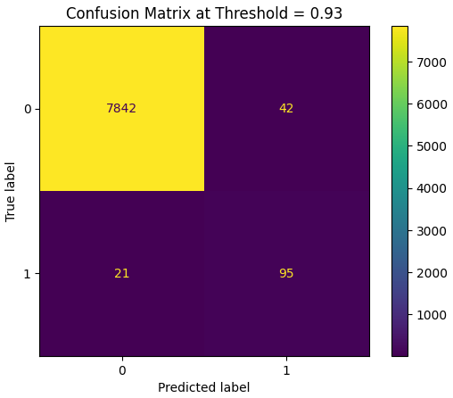
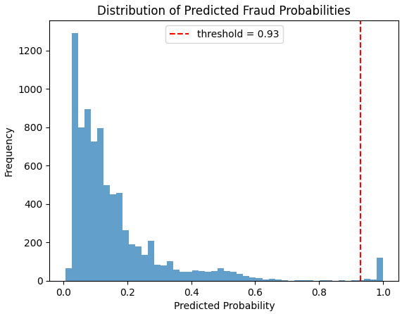
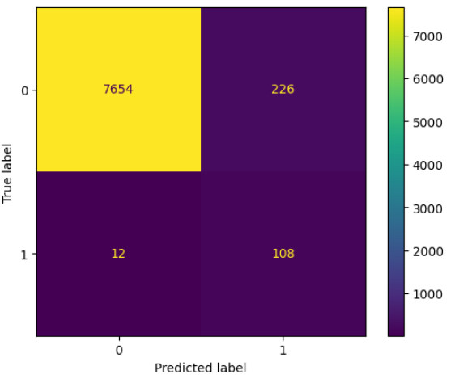

# Fraud Detection ML Pipeline

A machine learning pipeline for credit card fraud detection under highly imbalanced class distribution.

This project focuses on preprocessing tabular transaction data, handling class imbalance, training an XGBoost classifier, and optimizing the decision threshold using fraud-class F1-score.

## Overview

Fraud detection is a typical imbalanced classification problem. In this dataset, fraudulent transactions account for only about 1.45% of all records, with an approximate non-fraud to fraud ratio of 68:1.

Because of this imbalance, accuracy alone is not a reliable metric. This project evaluates the model using fraud-class precision, recall, F1-score, ROC-AUC, and PR-AUC.

## Dataset

The dataset contains 40,000 transaction records with anonymized attributes and one target label:

- `fraud = 0`: normal transaction
- `fraud = 1`: fraudulent transaction

The full dataset is not included in this repository. A small sample file is provided only to show the expected input format.

## Methodology

The pipeline includes:

```text
Preprocessing → SMOTEENN → XGBoost Classifier → Threshold Tuning
```

### Preprocessing

- Numerical features are scaled with `StandardScaler`
- Categorical features are encoded with `OneHotEncoder`
- A stratified train-validation split is used to preserve the fraud ratio

### Imbalance Handling

The dataset is highly imbalanced, so the pipeline uses:

- `SMOTEENN` for resampling
- `scale_pos_weight` in XGBoost
- PR-AUC and fraud-class F1-score for evaluation

### Model

The final model uses `XGBClassifier` with `eval_metric="aucpr"`.

## Results

The model was evaluated on a stratified validation split.

| Metric | Score |
|---|---:|
| Best threshold | 0.93 |
| Fraud precision | 0.69 |
| Fraud recall | 0.82 |
| Fraud F1-score | 0.75 |
| ROC-AUC | 0.9852 |
| PR-AUC | 0.6442 |

Confusion matrix:

```text
[[7842   42]
 [  21   95]]
```

### Confusion Matrix



### Predicted Fraud Probability Distribution



## Improvement from Baseline

The original model used the default decision threshold of `0.5`.

After restructuring the validation pipeline and tuning the threshold based on fraud-class F1-score, the model achieved a significantly better precision-recall balance.

| Metric | Baseline Threshold 0.5 | Tuned Threshold 0.93 |
|---|---:|---:|
| False Positives | 226 | 42 |
| False Negatives | 12 | 21 |
| Fraud Precision | 0.32 | 0.69 |
| Fraud Recall | 0.90 | 0.82 |
| Fraud F1-score | 0.48 | 0.75 |
| Accuracy | 0.97 | 0.99 |
| ROC-AUC | 0.9806 | 0.9852 |

Threshold tuning reduced false positives from 226 to 42 and improved fraud-class F1-score from 0.48 to 0.75.

### Baseline Confusion Matrix



## Tech Stack

- Python
- pandas
- NumPy
- scikit-learn
- imbalanced-learn
- XGBoost
- Matplotlib

## Notes

This project was originally developed for a university Data Science course and later refactored.

Since the original Kaggle hidden test labels are no longer available, the optimized results are reported using a stratified validation split.
